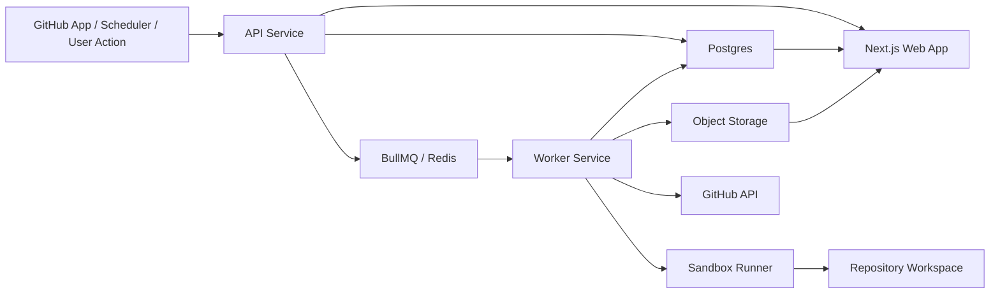

# Dependency Steward Design Document

## Document Status

1. Status: Implementation-ready blueprint
2. Last updated: 2026-04-14
3. Intended audience: project owner and future contributors
4. Primary purpose: define an implementation-ready blueprint before repository scaffolding
5. Current decision level: MVP architecture and operating decisions finalized for scaffolding
6. Guiding principle: deterministic orchestration first, agentic assistance second

## 1. Overview

Dependency Steward is a full-stack agentic platform that automates two related engineering workflows for GitHub repositories:

1. Dependency upgrade automation
2. Test backfill automation when coverage falls below a configured threshold

The core product wedge is safety-first orchestration. Instead of acting like a generic dependency bump bot, the system determines whether a repository is sufficiently protected by tests before attempting risky upgrades. If coverage or confidence is too low, it creates a test-backfill pull request first. After confidence improves, it opens the dependency upgrade pull request.

This design targets a portfolio-quality MVP that is realistic to build, technically credible, and demonstrably useful to engineering teams.

### 1.1 Problem Statement

Dependency maintenance is usually treated as a separate problem from code confidence. In practice, teams delay upgrades because they do not trust their tests, do not know the blast radius of a dependency change, and do not want to spend time on manual triage for every package bump. Existing tools usually detect available upgrades, but they stop before the expensive part: making a repository safe enough to accept change.

### 1.2 Product Wedge

Dependency Steward is differentiated by combining three capabilities in one control loop:

1. Dependency intelligence
2. Coverage-aware policy enforcement
3. Safe, reviewable pull request automation

The important behavior is not merely "open a dependency PR." The important behavior is "decide whether the repo is ready for that dependency PR, improve confidence if it is not, then produce the PR with evidence."

### 1.3 MVP Success Criteria

The MVP is successful if it can reliably do all of the following on seeded demo repositories:

1. Detect an outdated or vulnerable dependency and create a verified upgrade PR for a low-risk case.
2. Detect a risky or under-protected upgrade candidate and create a test-backfill PR first.
3. Improve measurable coverage without changing production source code in the test-backfill flow.
4. Present enough run evidence in the UI that a reviewer can understand why the system acted the way it did.
5. Produce PRs that are coherent enough to be reviewed like normal engineering work, not like opaque AI output.

## 2. Product Thesis

Most existing dependency bots optimize for update detection and branch creation. They do not materially improve a repository's readiness for change. Dependency Steward treats upgrade safety as an engineering systems problem:

1. Detect outdated or vulnerable dependencies
2. Estimate change risk
3. Measure repository confidence using coverage and test health
4. Backfill missing unit tests when policy requires it
5. Upgrade dependencies in isolated branches
6. Verify changes with deterministic checks
7. Open reviewable pull requests with clear evidence

The product is valuable because it converts a maintenance burden into a controlled workflow with measurable outcomes.

## 3. Goals

### 3.1 Primary Goals

1. Automatically detect outdated and vulnerable JavaScript or TypeScript dependencies.
2. Open dependency upgrade pull requests with risk summaries and verification artifacts.
3. Detect when repository or impacted-module coverage falls below policy.
4. Open unit-test backfill pull requests before risky upgrades when confidence is too low.
5. Provide an operator console that explains every decision, action, and result.
6. Produce a system architecture that can later support more ecosystems without rewrites.

### 3.2 Secondary Goals

1. Support grouped low-risk upgrades.
2. Track coverage trend and upgrade success analytics over time.
3. Support constrained auto-repair for straightforward upgrade breakages.
4. Make the system explainable enough for engineering review and portfolio demos.

## 4. Non-Goals for MVP

1. Multi-language dependency support beyond JavaScript and TypeScript.
2. End-to-end or browser test generation.
3. Automatic merge of generated pull requests.
4. Organization-wide RBAC and enterprise identity features.
5. Slack or Teams bot interfaces.
6. Broad source-code refactoring beyond narrow, approved repair classes.

## 5. Users and Use Cases

### 5.1 Primary User

A software engineer or small engineering team that wants safer upgrades, stronger tests, and less manual maintenance work.

### 5.2 Core Use Cases

1. A repository has patch or minor updates available, and the system opens verified dependency PRs.
2. A repository has a vulnerable package, and the system prioritizes the security fix with a clear risk summary.
3. A repository has weak coverage around modules impacted by a dependency upgrade, and the system opens a test PR first.
4. An engineer wants to inspect why the system chose a test-backfill PR rather than an upgrade PR.
5. An engineer wants to tune coverage thresholds, allowed upgrade types, or verification commands per repository.

## 6. MVP Scope

### 6.1 Supported Platforms

1. GitHub repositories only
2. npm and pnpm package managers in v1
3. Jest and Vitest test runners in v1
4. Coverage input through lcov and Istanbul-compatible JSON

### 6.2 Pull Request Types

1. Test backfill pull requests
2. Dependency upgrade pull requests

### 6.3 Trigger Modes

1. Scheduled scans
2. Manual run from UI
3. Webhook-triggered follow-up runs after PR merge or push to default branch

### 6.4 Operating Assumptions

1. The repository has a committed lockfile.
2. The package manager can be inferred from repository files.
3. The repository exposes enough test and coverage commands to run in a sandbox.
4. The default branch remains human-reviewed and protected outside the product.
5. The first version targets repositories where unit-test generation is technically feasible with existing project conventions.
6. The system is allowed to create branches and pull requests, but not to merge them automatically.

## 7. Product Requirements

### 7.1 Functional Requirements

1. Connect to repositories through a GitHub App.
2. Parse package manifests and lockfiles.
3. Detect outdated dependencies and known vulnerabilities.
4. Fetch release metadata and summarize upgrade impact.
5. Ingest coverage results and map them to source files.
6. Enforce repository policy before opening PRs.
7. Generate unit tests for selected low-coverage modules.
8. Run install, lint, typecheck, unit tests, and coverage commands in a sandbox.
9. Create branches and pull requests with structured summaries.
10. Persist run logs, artifacts, policies, and outcomes.

### 7.2 Non-Functional Requirements

1. All code execution must run in isolated ephemeral workspaces.
2. Every run must have a traceable audit log.
3. The system must fail closed when verification is incomplete.
4. Long-running operations must be handled asynchronously.
5. The UI must expose enough execution detail to justify agent actions.

## 8. Product Behavior

### 8.1 High-Level Decision Flow

1. Detect dependency update candidate.
2. Score the upgrade risk.
3. Identify impacted modules or package surfaces.
4. Read coverage and test-health signals.
5. If policy thresholds are met, run dependency upgrade flow.
6. If policy thresholds are not met, run test-backfill flow first.
7. If a tests-first route is chosen, persist a deferred upgrade record linked to the prerequisite test-backfill PR.
8. After the test-backfill PR is merged into the default branch, re-evaluate the deferred upgrade against the new base state before creating any upgrade PR.

### 8.2 Example Orchestration Rule

If a dependency upgrade has medium or high risk and the impacted-module coverage is below threshold, the system must create a test-backfill PR and a deferred upgrade record before attempting any dependency upgrade PR.

### 8.3 Manual Review as a First-Class Outcome

Manual review is a first-class routing outcome, not a generic failure fallback. When the system cannot safely automate, it must preserve the reason, evidence, and next recommended action in a durable run state that the UI can present to an operator.

## 9. System Architecture

The recommended implementation is an all-TypeScript monorepo.

### 9.1 Top-Level Components

1. Web app
Responsible for dashboard, repository settings, run detail pages, policies, analytics, and operator review.

2. API service
Responsible for GitHub App webhooks, repository onboarding, run orchestration requests, policy management, and read APIs for the UI.

3. Worker service
Responsible for scans, repository cloning, sandbox execution, dependency analysis, coverage analysis, test generation, upgrade runs, and PR creation.

4. Queue and scheduler
Responsible for durable background jobs, retries, scheduling, and execution sequencing.

5. Database
Responsible for persistent system state, including repositories, policies, runs, artifacts, coverage snapshots, dependency snapshots, and PR records.

6. Object storage
Responsible for logs, coverage reports, generated patch artifacts, and run attachments.

7. LLM adapter
Responsible for structured prompt execution, tool result normalization, and provider isolation.

### 9.2 Recommended Stack

1. Next.js for the web app
2. Fastify for the API service
3. BullMQ with Redis for jobs and scheduling
4. Postgres with Prisma for persistence
5. Docker for sandboxed execution
6. GitHub App integration using Octokit
7. OpenAI-compatible provider adapter initially pinned to GPT-5.4 for MVP agent tasks

### 9.3 Architecture Principles

1. Keep orchestration deterministic unless language-model assistance materially improves output quality.
2. Separate control-plane responsibilities from execution-plane responsibilities.
3. Treat every pull request as an auditable artifact of a bounded run.
4. Prefer isolated services with narrow package boundaries over a large shared runtime.
5. Fail closed when repository state, coverage state, or verification state is ambiguous.

### 9.4 End-to-End Request and Job Flow



### 9.5 Service Boundaries

1. The web app is read-heavy and should not contain orchestration logic.
2. The API service is the control plane for user-triggered actions, webhook intake, repository setup, and read APIs.
3. The worker service is the execution plane for scans, analysis, sandbox work, and PR creation.
4. The sandbox is not a general-purpose shell environment. It is a tightly constrained execution target owned by the worker.
5. The database is the source of truth for run state. Redis is not a durable system of record.

### 9.6 Deployment Topology

1. Web and API may be deployed together initially for simplicity, but should remain logically separate.
2. Worker execution must be deployed separately so queue backlogs do not affect the user-facing UI.
3. Postgres, Redis, and object storage should be shared infrastructure services.
4. Sandboxes should be ephemeral and disposable, with no cross-run filesystem reuse except explicit package cache directories.

### 9.7 Failure Domains

1. GitHub webhook ingestion failure must not lose events permanently.
2. Worker crashes must leave runs recoverable or clearly failed.
3. Sandbox failure must not corrupt repository metadata or policy state.
4. LLM failure must degrade gracefully into manual-review recommendations where possible.

## 10. Proposed Monorepo Layout

The repository to be created should use the following structure:

```text
dependency-steward/
  apps/
    web/
    api/
    worker/
  packages/
    config/
    db/
    github/
    queue/
    sandbox/
    dependency-intelligence/
    coverage-intelligence/
    agent-core/
    policy-engine/
    prompt-kit/
    ui/
    shared/
  docs/
  infra/
  scripts/
  .github/
```

### 10.1 Package Responsibilities

1. config
Shared TypeScript, lint, formatting, and environment configuration.

2. db
Prisma schema, migrations, database client, and query helpers.

3. github
GitHub App client, webhook verification, repository access helpers, branch creation, and pull request helpers.

4. queue
BullMQ queues, worker bindings, job contracts, and scheduler utilities.

5. sandbox
Ephemeral workspace creation, Docker execution, command allowlists, artifact capture, and cleanup.

6. dependency-intelligence
Manifest parsing, lockfile reading, outdated dependency detection, advisory ingestion, changelog retrieval, and semver comparison.

7. coverage-intelligence
Coverage artifact ingestion, lcov parsing, file and module coverage mapping, and threshold evaluation.

8. agent-core
Agent orchestration, structured action contracts, run state machines, retry policies, and evaluation hooks.

9. policy-engine
Per-repository thresholds, enforcement rules, and run-routing decisions.

10. prompt-kit
Prompt templates, schemas, output validators, and redaction helpers.

11. ui
Reusable UI primitives and domain components shared by the web app.

12. shared
Cross-service types, enums, DTOs, and utility functions.

### 10.2 App Responsibilities

1. apps/web
Owns dashboards, repository pages, run detail pages, policy editing, onboarding, and analytics views.

2. apps/api
Owns GitHub App webhook processing, REST endpoints, authentication, repo management, and orchestration entry points.

3. apps/worker
Owns scheduled scans, queue consumers, sandbox jobs, test generation, dependency upgrades, artifact uploads, and PR creation.

### 10.3 Package Dependency Rules

1. apps/web may depend on ui, shared, and API client packages only.
2. apps/api may depend on db, github, queue, policy-engine, shared, and read-only helper packages.
3. apps/worker may depend on db, github, queue, sandbox, dependency-intelligence, coverage-intelligence, agent-core, prompt-kit, policy-engine, and shared.
4. The db package must not depend on application packages.
5. The prompt-kit package must not execute I/O directly.

### 10.4 Initial Repository Skeleton Expectations

The first scaffolding pass should include at least the following implementation artifacts:

1. Workspace root configuration for package management, TypeScript, linting, formatting, and testing.
2. apps/web with a minimal dashboard shell and repository detail route.
3. apps/api with health endpoints, webhook endpoints, and repository CRUD routes.
4. apps/worker with queue bootstrap, scheduler bootstrap, and one stubbed scan job.
5. packages/db with Prisma schema and generated client setup.
6. packages/shared with core enums, DTOs, and validation schemas.
7. packages/queue with job contracts and queue names.
8. packages/github with installation client bootstrap and pull request helpers.

## 11. Domain Model

### 11.1 Core Entities

1. User
Application user with linked GitHub identity and installation visibility.

2. Repository
Connected GitHub repository with metadata, default branch, detected package manager, test framework, and current health summary.

3. Policy
Per-repository settings for thresholds, allowed upgrade types, verification commands, retry rules, and automation behavior.

4. DependencySnapshot
Point-in-time list of discovered dependencies, versions, type, direct or transitive classification, and update availability.

5. AdvisoryRecord
Security advisories linked to package names, affected ranges, severity, and remediation recommendations.

6. CoverageSnapshot
Repository-wide and file-level coverage metrics with associated artifact locations.

7. Run
A top-level execution unit for scan, backfill, upgrade, or follow-up analysis.

8. RunStep
An individual step within a run, including status, logs, structured inputs, outputs, and duration.

9. Artifact
Structured or binary output such as coverage reports, logs, changelog summaries, patch files, and sandbox transcripts.

10. PullRequestRecord
Metadata for created pull requests, including branch names, URLs, titles, status, and post-merge state.

11. DeferredUpgrade
Pinned record for an upgrade candidate that is intentionally delayed until a prerequisite test-backfill PR is merged into the default branch.

12. EvaluationRecord
Assessment of run quality, including whether it succeeded, coverage delta, test stability, and operator outcome.

### 11.2 Key Relationships

1. A repository has one active policy and many historical policies.
2. A repository has many runs, dependency snapshots, coverage snapshots, and deferred upgrades.
3. A run has many steps and many artifacts.
4. A run may produce zero or one pull requests in MVP.
5. A deferred upgrade links an originating tests-first decision to a later upgrade run.
6. A dependency snapshot may link to many advisory records.

### 11.3 Suggested First-Cut Table Fields

1. User
id, githubUserId, login, avatarUrl, createdAt, updatedAt

2. Repository
id, installationId, owner, name, fullName, defaultBranch, packageManager, testFramework, onboardingState, activePolicyId, lastScanAt, createdAt, updatedAt

3. Policy
id, repositoryId, minRepoCoverage, minImpactedCoverage, allowedUpgradeKinds, securityOverrideEnabled, autoCreatePrs, testBackfillEnabled, maxRepairAttempts, requiredPassingTestRuns, coverageSourcePreference, coverageWorkflowName, coverageArtifactName, lifecycleScriptsPolicy, createdAt, updatedAt

4. DependencySnapshot
id, repositoryId, commitSha, generatedAt, manifestPath, lockfilePath, packageManager

5. DependencyCandidate
id, snapshotId, packageName, currentVersion, targetVersion, kind, directness, advisorySeverity, riskScore, riskTier, recommendedAction, changelogSummary, status

6. CoverageSnapshot
id, repositoryId, commitSha, generatedAt, linePct, branchPct, functionPct, statementPct, artifactId

7. CoverageFileMetric
id, coverageSnapshotId, filePath, linePct, branchPct, functionPct, statementPct, uncoveredLines, uncoveredBranches

8. Run
id, repositoryId, runType, triggerSource, status, baseBranch, baseSha, policyVersion, correlationId, startedAt, endedAt, summary, failureCategory, blockingReason, resumedFromDeferredUpgradeId

9. RunStep
id, runId, stepKey, status, startedAt, endedAt, inputJson, outputJson, logArtifactId, errorCode

10. PullRequestRecord
id, repositoryId, runId, githubPrNumber, title, url, branchName, prType, status, mergedAt, mergeCommitSha

11. DeferredUpgrade
id, repositoryId, originatingRunId, prerequisitePrId, dependencyCandidateId, packageName, targetVersion, originBaseSha, effectiveBaseSha, policyVersion, status, createdAt, resumedAt, resolvedAt

12. Artifact
id, runId, artifactType, storageKey, contentType, byteSize, createdAt

13. EvaluationRecord
id, runId, coverageDelta, passedVerification, flakeDetected, generatedFilesCount, acceptedByHuman, createdAt

### 11.4 Run State Model

Suggested top-level run states:

1. queued
2. preparing
3. running
4. awaiting_manual_review
5. waiting_for_followup
6. succeeded
7. failed
8. cancelled
9. superseded

Suggested step-level states:

1. pending
2. in_progress
3. blocked
4. succeeded
5. failed
6. skipped

### 11.5 Idempotency Model

1. Scan runs should be deduplicated by repository plus branch plus trigger window.
2. Upgrade runs should be deduplicated by repository plus package plus target version plus effective base SHA plus policy version.
3. Test-backfill runs should be deduplicated by repository plus selected file set plus coverage snapshot plus policy version.
4. Deferred upgrade records should be deduplicated by repository plus package plus target version plus prerequisite PR plus policy version.
5. GitHub webhook deliveries should be deduplicated by delivery identifier before enqueueing jobs.

## 12. Workflow Design

### 12.1 Dependency Scan Workflow

1. Clone repository metadata and fetch configuration.
2. Parse package.json and supported lockfiles.
3. Build dependency inventory.
4. Query npm registry and OSV or security sources.
5. Compare installed versus available versions.
6. Generate dependency candidates.
7. Persist snapshot and candidate list.

### 12.2 Risk Analysis Workflow

1. Compute semver distance.
2. Check for advisory severity.
3. Fetch release notes or changelog metadata.
4. Extract breaking-change indicators.
5. Read repository test health and flake signals.
6. Read coverage around impacted modules.
7. Produce a risk score and rationale.

### 12.3 Test Backfill Workflow

1. Load the latest coverage snapshot for the current default-branch head or generate a fresh baseline if none exists.
2. Detect threshold breaches.
3. Rank candidate files for test generation.
4. Mine existing repository test patterns.
5. Generate deterministic unit tests.
6. Run tests repeatedly to detect flakes.
7. Measure coverage delta against the baseline captured for that same default-branch head.
8. Open pull request only if the result is stable and coverage improves.

### 12.4 Dependency Upgrade Workflow

1. Create isolated branch.
2. Apply dependency version bump.
3. Refresh lockfile using detected package manager.
4. Run lockfile refresh, dependency installation, lint, typecheck, tests, and coverage using approved command templates and default-disabled lifecycle scripts.
5. If failures occur, attempt approved repair actions.
6. Re-run verification after each approved repair.
7. Open pull request only when policy conditions are satisfied.

### 12.5 Follow-Up Workflow

1. Detect when a test-backfill PR is merged into the default branch.
2. Load the deferred upgrade record pinned to the original package, target version, origin base SHA, and policy version.
3. Re-resolve the dependency candidate against the new default-branch head.
4. If the package was already upgraded, removed, or blocked by a newer policy, close the deferred record as resolved or superseded without opening a PR.
5. If the candidate remains valid, create a new upgrade run using the current default-branch head as the effective base SHA and link it to the deferred record.
6. Recompute coverage confidence and proceed only if the normal safety gates pass.

### 12.6 Concurrency Rules

1. Allow at most one upgrade run per repository at a time in MVP.
2. Allow one scan run and one execution run per repository concurrently if they do not mutate the same branch.
3. Reserve test-backfill branches so multiple workers cannot generate competing PRs for the same coverage gap.
4. Reject or merge duplicate queued jobs using idempotency keys rather than letting duplicate PRs occur.
5. Allow at most one active deferred upgrade record per repository, package, and target version combination.

### 12.7 Branch and Pull Request Conventions

1. Test backfill branch format: ds/tests/<run-id>/<target-slug>
2. Upgrade branch format: ds/upgrade/<package-name>/<target-version>
3. Pull request labels: ds-generated, dependency-upgrade, test-backfill, risk-low, risk-medium, risk-high
4. Pull request body sections: summary, rationale, verification, changed files, reviewer focus, risks, next steps

### 12.8 Escalation Rules

Route work to manual review instead of automated PR creation when any of the following occurs:

1. Coverage cannot be computed reliably.
2. The required package manager or test framework is unsupported.
3. The upgrade requires production-code changes outside approved repair classes.
4. Generated tests are unstable or fail validation.
5. The repository exceeds a configured change budget for the run.
6. The repository requires install lifecycle scripts but is not explicitly allowlisted for script execution.
7. A deferred upgrade no longer matches repository state after the prerequisite PR merge.

### 12.9 Manual Review Workflow

1. Move the run to awaiting_manual_review with a machine-readable blockingReason and recommended next action.
2. Persist all diagnostics, artifacts, and policy context required for human review.
3. Surface the manual-review item in the dashboard and repository detail views until an operator resolves it.
4. Allow an operator to dismiss, requeue, or supersede the work through an explicit follow-up action that creates a new run.
5. Never auto-resume an awaiting_manual_review run without a new explicit trigger.

## 13. Agent Model

This system should use constrained agents rather than a freeform autonomous loop.

### 13.1 Suggested Agents

1. Dependency Detector
Finds outdated and vulnerable packages.

2. Risk Analyst
Summarizes upgrade risk and likely breakage patterns.

3. Coverage Analyst
Evaluates whether policy thresholds are met and identifies low-confidence modules.

4. Test Planner
Determines which modules and scenarios are worth covering.

5. Test Generator
Produces unit test files aligned with repository conventions.

6. Upgrade Executor
Applies version bumps and runs verification commands.

7. Repair Agent
Attempts tightly scoped fixes for known safe classes.

8. PR Composer
Writes pull request titles, bodies, and reviewer guidance.

### 13.2 Agent Operating Rules

1. Agent output must be schema-validated.
2. Tool access must be explicit and typed.
3. The system must enforce maximum retries and timeouts.
4. Agents must not directly edit production code during test backfill in MVP.
5. Agents must not bypass verification gates.

### 13.3 Model Provider Abstraction

The LLM integration should be behind a small provider interface even though the MVP is intentionally pinned to GPT-5.4. The provider interface should expose methods like the following:

1. generateStructured
For JSON-schema or Zod-schema validated responses.

2. summarizeText
For changelog and PR narrative generation where exact structure is less critical.

3. classify
For small routing decisions if deterministic logic is insufficient.

Every model call should capture model name, prompt version, token usage, latency, and schema validation result for later analysis.

### 13.4 Agent Output Contracts

Every agent should emit a narrow structured object rather than free text. Example contract categories:

1. Risk analysis output
score, tier, rationale, breakingSignals, recommendedAction

2. Test plan output
targetFiles, scenarioList, helperUsage, expectedCoverageAreas

3. Repair proposal output
repairClass, affectedFiles, explanation, confidence, allowedUnderPolicy

4. PR composition output
title, summary, bulletPoints, reviewerFocus, knownRisks

### 13.5 Prompt and Context Strategy

1. Prefer extracted structured context over raw repository dumps.
2. Include only relevant file snippets, existing test examples, and summarized diagnostics.
3. Version prompts explicitly so behavior changes are traceable.
4. Keep prompts package-local so they are easy to test and evolve.

### 13.6 Recommended Model for MVP

Dependency Steward should use GPT-5.4 as the primary and only general-purpose LLM in MVP.

1. Primary model: GPT-5.4
2. Primary uses: structured risk analysis, test planning, deterministic unit-test generation, repair proposal drafting, and PR composition
3. Operating mode: low-temperature structured generation for schema-bound tasks and slightly higher temperature only for narrative summaries
4. Fallback behavior: retry within bounded limits, then route to manual review rather than silently switching models
5. Rationale: strong code reasoning, reliable instruction following, strong structured-output performance, and enough context capacity to work from extracted repository evidence without requiring multiple model families

## 14. Policy Engine

The policy engine is central to the product and should remain deterministic.

### 14.1 Initial Policy Fields

1. Minimum repository coverage percentage
2. Minimum impacted-module coverage percentage
3. Allowed upgrade types: patch, minor, major
4. Security-first override behavior
5. Verification command set
6. Maximum repair attempts per run
7. Pull request grouping strategy
8. Automatic PR creation enabled or disabled
9. Test generation allowed or disabled
10. Flake threshold for generated tests
11. Coverage source preference: worker-generated or GitHub Actions artifact
12. Optional GitHub Actions coverage workflow and artifact names
13. Lifecycle script policy: disallow by default, allowlist only

### 14.2 Example Policy

1. Minimum repository coverage: 80 percent
2. Minimum impacted-module coverage: 75 percent
3. Allowed upgrade types: patch and minor
4. Security advisories may bypass normal scheduling and normal semver-kind restrictions, but not safety gates
5. Maximum repair attempts: 2
6. Generated tests must pass 3 consecutive times before PR creation
7. Coverage source preference: GitHub Actions artifact first, worker-generated fallback
8. Coverage artifact configuration: named workflow plus named artifact
9. Lifecycle scripts: disabled by default unless the repository is explicitly allowlisted

### 14.3 Policy Evaluation Order

The policy engine should execute in a fixed order so runs remain explainable:

1. Validate repository support matrix.
2. Load active policy.
3. Evaluate dependency candidate severity and semver kind.
4. Determine whether security override applies.
5. Check whether the candidate is allowed under policy after override semantics are applied.
6. Resolve coverage availability.
7. Evaluate repository-level threshold.
8. Evaluate impacted-module threshold.
9. Decide between upgrade-now, tests-first, or manual-review.
10. Enforce retry, change-budget, and autopatch limits.

### 14.4 Suggested Decision Pseudocode

```text
if repo_not_supported:
  return manual_review("unsupported repository configuration")

security_override_applies = advisory_severity in [high, critical] and security_override_enabled

if upgrade_kind_not_allowed and not security_override_applies:
  return manual_review("upgrade kind blocked by policy")

if coverage_missing and policy_requires_coverage:
  return manual_review("coverage unavailable")

if impacted_mapping_confidence_low and policy_requires_impacted_coverage:
  return manual_review("impacted coverage confidence too low")

if risk_tier in [medium, high] and impacted_coverage < threshold:
  if test_backfill_enabled and dependency_kind in [patch, minor]:
    return create_test_backfill_pr_and_defer_upgrade
  return manual_review("coverage below threshold")

return create_upgrade_pr
```

### 14.5 Security Override Precedence

1. Security override may raise queue priority and bypass normal upgrade-kind restrictions for advisories.
2. Security override does not bypass repository support checks, coverage availability checks, impacted-coverage safety gates, or verification requirements.
3. If a security fix is urgent but safety prerequisites are not met, the system must choose tests-first or manual-review rather than silently lowering safety standards.

## 15. Risk Scoring Model

The MVP should expose an understandable risk score instead of a black-box score.

### 15.1 Risk Inputs

1. Semver jump magnitude
2. Advisory severity
3. Breaking-change language in release notes
4. Package criticality in the repository graph
5. Current test pass rate
6. Current coverage around impacted modules
7. Historical instability for the repository

### 15.2 Suggested Output Shape

1. Numerical score from 0 to 100
2. Risk tier: low, medium, high
3. Human-readable rationale
4. Recommended action: upgrade now, add tests first, or manual review

### 15.3 Initial Weighting Guidance

The first implementation should use a transparent weighted heuristic rather than a learned scoring model. Example score contributors:

1. Semver jump: 0 to 25 points
2. Advisory severity: 0 to 20 points
3. Breaking-change language: 0 to 15 points
4. Low impacted coverage penalty: 0 to 15 points
5. Historical test instability: 0 to 10 points
6. Repository criticality of the package: 0 to 15 points

### 15.4 Tier Thresholds

1. Low: 0 to 29
2. Medium: 30 to 59
3. High: 60 to 100

These thresholds should be persisted as configuration so they can be tuned without rewriting orchestration logic.

## 16. Coverage Intelligence Design

### 16.1 Supported Coverage Inputs

1. lcov.info generated in the worker
2. Istanbul-compatible JSON summary
3. Coverage directory artifact uploaded by the worker
4. GitHub Actions artifact matching a configured workflow and artifact name in v1

### 16.2 Coverage Decisions

1. Repository-level threshold passed or failed
2. Impacted-module threshold passed or failed
3. File candidates ranked for new tests
4. Coverage delta after generated tests

### 16.3 Candidate Selection Strategy

Prefer these targets in v1:

1. Pure utility modules
2. Validation logic
3. Reducers and selectors
4. Formatting or transformation functions
5. Adapter layers with stable inputs

Defer these targets in v1:

1. Integration-heavy services
2. Modules requiring deep environment mocking
3. Browser-dependent logic without existing test harness
4. Files that already show high flake probability

### 16.4 Impacted-Module Mapping Strategy

The first version should use a practical heuristic rather than a perfect dependency graph.

1. Identify source files that directly import or reference the dependency package.
2. Include nearby adapter modules and wrappers that isolate third-party behavior.
3. Include existing test files that already cover those modules.
4. Expand one hop outward through local imports if the directly impacted set is too small.
5. Fall back to repository-level coverage rules when mapping confidence is low.

### 16.5 Coverage Availability Fallbacks

1. If the repository configures GitHub Actions coverage ingestion, prefer the latest successful matching workflow run on the default branch.
2. Validate artifact provenance, expected file layout, and commit association before using the artifact as a baseline.
3. Fall back to worker-generated coverage if GitHub Actions coverage is unavailable and commands are configured.
4. If neither is available and policy requires coverage, do not guess. Route to manual review.

### 16.6 Minimum Coverage Delta for Test PRs

To avoid noisy PRs, generated test pull requests should meet a minimum measurable improvement threshold such as one of the following:

1. At least 2 percentage points of line coverage on targeted files
2. At least one previously uncovered branch now covered
3. At least one previously uncovered exported path now tested

### 16.7 Coverage Baseline Semantics

1. Every test-backfill run must compare against a baseline taken from the same default-branch head used to select target files.
2. Coverage deltas must be recorded with both baseline commit SHA and post-run commit SHA.
3. If the default branch changes before the run can produce a PR, the run should be superseded or re-run rather than reporting a stale delta.

## 17. Test Generation Strategy

### 17.1 Inputs

1. Source file content
2. Existing neighboring test files
3. Test framework conventions
4. Coverage gap locations
5. Exported function signatures and usage patterns

### 17.2 Generation Principles

1. Prefer small, deterministic unit tests.
2. Avoid giant snapshot tests unless the repository already uses them pervasively.
3. Reuse local test helpers where possible.
4. Do not modify production files in the backfill flow.
5. Generate readable tests that reviewers can evaluate quickly.

### 17.3 Stability Gate

Generated tests must pass multiple consecutive runs before a PR is opened. This avoids shipping obvious flakes and materially strengthens the project credibility.

### 17.4 Test Generation Validation Loop

1. Generate candidate test file contents.
2. Validate syntax and framework compatibility.
3. Run only the generated tests first for fast feedback.
4. Run the full unit-test command after the targeted tests pass.
5. Generate coverage and compare against the baseline.
6. Reject the PR if any validation rule fails.

### 17.5 Rejection Criteria

Do not open a test-backfill PR if any of the following is true:

1. Production source files were modified.
2. Generated tests require unstable timing assumptions.
3. The full unit suite regresses.
4. Coverage does not improve meaningfully.
5. More than the configured maximum number of test files must be created.

## 18. Upgrade Repair Strategy

Repair must be narrow and explainable.

### 18.1 Allowed Repair Classes in MVP

1. Snapshot updates
2. Import path or symbol rename fixes with clear one-to-one mapping
3. Type annotation fixes caused by dependency type changes
4. Simple configuration migrations tied to known package releases

### 18.2 Disallowed Repair Classes in MVP

1. Broad production refactors
2. Business logic changes
3. Multi-step architecture rewrites
4. Any fix the system cannot explain in the pull request summary

### 18.3 Retry Budget and Stop Conditions

1. Maximum automated repair attempts per run should default to 2.
2. A repair loop must stop immediately if it requires unsupported file types or architectural edits.
3. A repair loop must stop if the number of changed files exceeds a configured ceiling.
4. A repair loop must stop if verification fails in a non-deterministic way across retries.
5. When repair stops, the run should produce a manual-review outcome with clear diagnostics rather than a silent failure.

## 19. GitHub Integration Design

### 19.1 GitHub App Permissions

1. Repository metadata read
2. Contents read and write
3. Pull requests read and write
4. Checks read and write
5. Issues read only if future enhancement requires linking advisories or tracking feedback
6. Actions read when GitHub Actions coverage ingestion is enabled

### 19.2 Webhooks

1. Installation created
2. Installation repositories added or removed
3. Push to default branch
4. Pull request opened, synchronized, closed, merged
5. workflow_run completed when GitHub Actions coverage ingestion is enabled
6. Optional check suite events for future CI coordination

### 19.3 Webhook Processing Lifecycle

1. Verify signature.
2. Deduplicate by delivery identifier.
3. Persist the event receipt.
4. Enqueue the relevant job.
5. Acknowledge quickly without doing heavy work inline.
6. Attach resulting run identifiers back to the event record for observability.

### 19.4 Pull Request Metadata Strategy

Generated PRs should include:

1. Consistent labels for filtering and analytics
2. A machine-readable footer with run identifier and policy version
3. A short rationale for why the PR exists now
4. Verification results with pass and fail counts
5. Explicit reviewer focus areas

### 19.5 GitHub Actions Coverage Artifact Retrieval

1. Repositories may optionally configure a GitHub Actions workflow name or ID and artifact name for coverage ingestion.
2. The worker retrieves the latest successful matching run on the default branch, downloads the artifact, validates expected coverage files, and records artifact provenance.
3. If retrieval fails or artifact contents are invalid, fall back to worker-generated coverage if policy allows; otherwise route to manual review.

## 20. API Design

### 20.1 Core API Areas

1. Authentication and session
2. Repositories and onboarding
3. Policies
4. Runs
5. Pull requests
6. Analytics

### 20.2 Example Endpoints

1. POST /api/repos/:repoId/scan
2. POST /api/repos/:repoId/backfill-tests
3. POST /api/repos/:repoId/upgrade/:candidateId
4. GET /api/repos/:repoId/runs
5. GET /api/runs/:runId
6. PATCH /api/repos/:repoId/policy
7. GET /api/repos/:repoId/dependencies
8. GET /api/repos/:repoId/coverage
9. POST /api/runs/:runId/requeue
10. POST /api/runs/:runId/resolve-manual-review

### 20.3 API Principles

1. All long-running actions must return a run identifier.
2. Run details must expose step-level status for the UI.
3. Structured error categories should be preserved for analytics.

### 20.4 Core Response Contracts

1. RunSummary
runId, runType, status, repositoryId, startedAt, endedAt, headline, recommendedAction, blockingReason, nextAction

2. RunDetail
RunSummary plus steps, artifacts, pullRequest, coverageDelta, dependencyCandidate, failureCategory, manualReview, deferredUpgrade

3. RepositorySummary
repoId, fullName, packageManager, testFramework, defaultBranch, healthStatus, latestCoverage, openGeneratedPrCount

4. PolicyView
policy fields plus lastUpdatedBy and lastUpdatedAt

5. DependencyCandidateView
packageName, currentVersion, targetVersion, advisorySeverity, riskTier, recommendedAction, changelogSummary

### 20.5 API Versioning Strategy

1. Keep the internal API unversioned initially if the UI and API ship together.
2. Version webhook payload adapters and worker job contracts explicitly.
3. Version public or external APIs once integrations beyond the first-party UI are introduced.

## 21. UI Design

The UI should present the system as an operator console, not a chat interface.

### 21.1 Core Screens

1. Dashboard
Shows connected repositories, pending upgrades, vulnerable packages, coverage violations, active manual-review items, and recent run outcomes.

2. Repository Detail
Shows dependency inventory, current policy, test health, recent PRs, and recommended actions.

3. Run Detail
Shows run steps, logs, diffs, generated tests, coverage deltas, repair attempts, blocking reasons, and final disposition.

4. Policy Editor
Lets users configure thresholds, upgrade types, verification commands, and automation preferences.

5. Pull Request History
Lists generated PRs, statuses, confidence, and merge outcomes.

6. Analytics
Shows upgrade success rate, coverage improvements, flake rates, and throughput.

### 21.2 UX Principles

1. Show evidence before conclusions.
2. Keep run traces easy to scan.
3. Make policy consequences obvious.
4. Separate test PRs from dependency PRs clearly.

### 21.3 Critical UI Components

1. Risk badge and rationale card
2. Coverage threshold comparison widget
3. Run timeline with step statuses
4. Artifact viewer for logs and coverage summaries
5. Diff summary card for generated tests or dependency bumps
6. Policy simulator that shows which action would be taken under current settings
7. Manual-review card with blocking reason, evidence links, and operator actions

### 21.4 Empty, Loading, and Failure States

1. Onboarding screens should explain why GitHub App installation is required.
2. Repositories with no coverage should surface that as an explicit state, not as zero coverage.
3. Run failures should display the failing step, error category, and next recommended action.
4. Unsupported repositories should show why they are unsupported and what would need to change.
5. Runs routed to manual review should display the blocking reason, recommended next action, and whether the work can be safely requeued.

## 22. Sandbox Execution Design

### 22.1 Requirements

1. Every run must execute in an isolated temporary workspace.
2. Only approved commands may be executed.
3. Secrets must never be written into repository files or logs.
4. All artifacts must be copied out before workspace cleanup.

### 22.2 Sandbox Lifecycle

1. Create temporary workspace
2. Clone repository branch
3. Install dependencies
4. Run designated commands
5. Collect logs and artifacts
6. Clean up workspace and container

### 22.3 Command Allowlist Strategy

The first version should allow only commands required for supported workflows, for example:

1. git fetch, checkout, branch, status, diff
2. npm ci --ignore-scripts, npm install --package-lock-only --ignore-scripts, npm test, npm run <approved-script>
3. pnpm install --ignore-scripts, pnpm install --lockfile-only --ignore-scripts, pnpm test, pnpm run <approved-script>
4. node-based analysis helpers bundled with the product

Commands should be assembled from known templates instead of accepting arbitrary model-generated shell strings.

### 22.3.1 Package Script Execution Policy

1. Install and lockfile refresh commands must disable lifecycle scripts by default.
2. Repositories that require lifecycle scripts are unsupported in MVP unless explicitly allowlisted by repository policy.
3. Script-enabled runs must execute with no repository secrets, minimal network egress, and elevated-risk audit labeling.
4. If dependency installation fails with lifecycle scripts disabled and no allowlist override exists, route to manual review.

### 22.4 Sandbox Filesystem Layout

1. /workspace/repo for the cloned repository
2. /workspace/artifacts for logs, coverage files, and patches
3. /workspace/cache for optional package-manager cache directories
4. /workspace/meta for run metadata injected by the worker

### 22.5 Network Policy

1. Permit access only to required registries, GitHub, and explicitly approved endpoints.
2. Do not expose service credentials to package scripts.
3. Prefer short-lived installation tokens fetched by the worker and injected only where necessary.
4. Limit CI artifact download access to GitHub endpoints required for configured coverage retrieval.

## 23. Persistence Design

### 23.1 Storage Split

1. Postgres stores relational state and run metadata.
2. Object storage stores large logs, coverage files, and patch artifacts.
3. Redis stores queue state and short-lived job coordination data.

### 23.2 Retention

1. Keep run summaries indefinitely for analytics.
2. Keep detailed logs for a bounded window, such as 30 to 90 days.
3. Keep pull request and evaluation records long-term.

### 23.3 Indexing and Query Priorities

Initial indexes should favor the most common read paths:

1. Repository by installationId and fullName
2. Run by repositoryId and createdAt
3. Run by status and runType
4. PullRequestRecord by repositoryId and status
5. DependencyCandidate by packageName, repositoryId, and status

### 23.4 Artifact Retention Policy

1. Keep text summaries longer than raw sandbox logs.
2. Expire large raw logs sooner than structured run metadata.
3. Retain coverage baselines for enough time to compare trend lines across multiple runs.

## 24. Security and Safety

### 24.1 Core Safety Rules

1. Use least-privilege GitHub App permissions.
2. Keep execution isolated per run.
3. Enforce command allowlists.
4. Redact secrets in logs and prompt inputs.
5. Require successful verification before PR creation.
6. Preserve a full audit trail for every run.

### 24.2 LLM Safety Rules

1. Use structured outputs with schema validation.
2. Limit prompts to necessary repository context.
3. Prohibit direct arbitrary command generation.
4. Constrain write targets during test generation.

### 24.3 Threat Model Summary

Primary threat categories for MVP:

1. Prompt injection from repository content
2. Malicious package scripts executed during install or test
3. Secret leakage through logs or prompt context
4. PR spam caused by duplicate or runaway jobs
5. Excessive file changes caused by an unconstrained repair loop

### 24.4 Controls

1. Sanitize and bound prompt inputs.
2. Keep secrets out of the sandbox whenever possible.
3. Disable install lifecycle scripts by default and allowlist exceptions explicitly.
4. Enforce per-repository PR rate limits.
5. Enforce maximum run time, maximum patch size, and maximum file count.
6. Preserve a full audit trail for post-incident review.

## 25. Observability

### 25.1 Required Signals

1. Job queue latency
2. Run success and failure rates
3. Coverage delta distribution
4. Repair attempt frequency
5. Pull request creation latency
6. Merge rate of generated PRs
7. Manual-review rate by reason code
8. Coverage source fallback rate from GitHub Actions to worker-generated execution
9. Lifecycle-script override rate

### 25.2 Logging

1. Step-level structured logs
2. Correlation identifiers per run
3. External call summaries for registry, GitHub, and LLM requests

### 25.3 Alerts and SLO Candidates

1. Alert if webhook processing backlog exceeds a defined threshold.
2. Alert if worker failure rate spikes by run type.
3. Alert if no scheduled scans complete for an expected window.
4. Alert if generated PR creation repeatedly fails for the same repository.
5. Track an internal SLO for time from scan detection to PR creation for low-risk upgrades.

## 26. Metrics for Product Value

1. Upgrade PR success rate
2. Upgrade PR merge rate
3. Median time from scan to PR creation
4. Mean coverage improvement from backfill PRs
5. Flake rate of generated tests
6. Percentage of upgrades deferred until coverage improved
7. Percentage of generated PRs accepted without manual code changes

## 27. Implementation Plan

### Phase 1: Foundation

1. Set up monorepo, shared config, and local development flow.
2. Build Next.js web shell and Fastify API shell.
3. Set up Postgres, Prisma, Redis, and BullMQ.
4. Implement GitHub App installation flow.
5. Create repository onboarding and policy persistence.

### Phase 2: Dependency Intelligence

1. Parse package manifests and lockfiles.
2. Build dependency snapshot pipeline.
3. Add registry and advisory lookups.
4. Add candidate recommendation and risk scoring.

### Phase 3: Upgrade Automation

1. Add sandbox execution.
2. Implement branch creation and dependency bumping.
3. Run install, lint, typecheck, tests, and coverage.
4. Create upgrade PR composer and run detail UI.

### Phase 4: Coverage Intelligence

1. Ingest and parse coverage reports.
2. Add repository and impacted-module threshold checks.
3. Show coverage trends and breach explanations in UI.

### Phase 5: Test Backfill Agent

1. Rank candidate files.
2. Infer local test conventions.
3. Generate unit tests.
4. Add flake-detection reruns.
5. Create test-backfill PR flow and UI details.

### Phase 6: Orchestration and Analytics

1. Connect policy engine to route between backfill and upgrade flows.
2. Resume deferred upgrades after backfill merges.
3. Add analytics dashboards and evaluation records.
4. Polish demo repositories and documentation.

### 27.1 Phase Acceptance Criteria

1. Phase 1 is complete when a repository can be onboarded, a policy can be stored, and a no-op run can be created and viewed.
2. Phase 2 is complete when the system can persist dependency candidates with risk metadata.
3. Phase 3 is complete when a low-risk upgrade PR can be created on a seeded repository.
4. Phase 4 is complete when repository and impacted-module coverage can be evaluated from persisted artifacts.
5. Phase 5 is complete when a generated test PR can improve coverage and pass stability gates.
6. Phase 6 is complete when the system can route between tests-first and upgrade-now paths and surface analytics.

### 27.2 Recommended Build Order for Fastest Useful Demo

1. Web and API shells with repository onboarding
2. Queue and worker bootstrapping
3. Dependency scan and candidate persistence
4. Upgrade PR flow for low-risk cases
5. Coverage ingestion and threshold gating
6. Test-backfill PR generation
7. Deferred upgrade resume flow
8. Analytics polish

## 28. Evaluation Plan

### 28.1 Technical Evaluation

1. Can the system create valid upgrade PRs on seeded demo repos?
2. Can the system create valid test PRs that improve coverage without modifying production code?
3. Does the system correctly choose tests-first for low-confidence upgrades?
4. Are generated tests stable across repeated runs?

### 28.2 Portfolio Evaluation

1. Can a reviewer understand the architecture quickly?
2. Can the demo show a clear before-and-after story?
3. Are decisions transparent rather than hand-wavy?
4. Does the product demonstrate both systems design and agentic workflow design?

## 29. Closed MVP Decisions

1. Grouped patch upgrades are deferred until after single-package flows are stable.
2. The first version supports both npm and pnpm.
3. The first version enforces both repository-level and impacted-module coverage thresholds.
4. PR creation remains automatic in MVP, with no mandatory human approval gate and no auto-merge.
5. GitHub Actions is the only supported external CI coverage source in MVP.
6. Install lifecycle scripts are disabled by default and require explicit allowlisting to be supported.

## 30. Finalized Decisions for Initial Build

1. Use the product name Dependency Steward.
2. Build an all-TypeScript monorepo.
3. Use Next.js, Fastify, BullMQ, Postgres, Prisma, Redis, and Docker.
4. Support GitHub, npm, pnpm, Jest, and Vitest in v1.
5. Support repository-level and impacted-module coverage thresholds.
6. Create PRs automatically but never auto-merge in MVP.
7. Limit automated repair to narrow, explainable fixes.
8. Use GPT-5.4 as the primary and only general-purpose LLM in MVP.

## 31. Deliverables for Next Step

After approval of this design document, the repository scaffolding step should create:

1. The monorepo folder structure described above
2. Shared configuration and workspace management
3. Initial database schema and migrations
4. API skeleton, worker skeleton, and web shell
5. Core domain packages and contracts
6. First-pass documentation for local development and system architecture

This sequencing keeps the next step focused on turning an approved system design into a coherent, reviewable codebase.

## 32. Testing Strategy for Dependency Steward Itself

### 32.1 Unit Tests

1. Policy evaluation logic
2. Dependency parsing and version comparison
3. Coverage parsing and threshold calculation
4. Risk scoring heuristics
5. Prompt output schema validation

### 32.2 Integration Tests

1. GitHub webhook intake and job enqueueing
2. Worker execution against disposable Postgres and Redis instances
3. Sandbox execution wrapper with controlled test repositories
4. Pull request creation logic against mocked GitHub APIs

### 32.3 End-to-End Tests

1. Seeded repository with low coverage and an outdated dependency
2. Seeded repository with good coverage and a safe patch bump
3. Seeded repository with unsupported characteristics to verify manual-review fallback

### 32.4 Regression Fixtures

Maintain small demo repositories or recorded run fixtures so future implementation changes can be validated against known expected outcomes.

## 33. Environment and Deployment Plan

### 33.1 Local Development

1. Docker Compose for Postgres and Redis
2. Local file-backed storage for artifacts during development
3. GitHub App credentials loaded from environment variables
4. Worker and API run in watch mode

### 33.2 Staging Environment

1. Shared staging GitHub App installation
2. Isolated Postgres, Redis, and object storage bucket
3. Restricted set of demo repositories for validation

### 33.3 Production Environment

1. Managed Postgres, Redis, and object storage
2. Separate worker autoscaling policy from API scaling policy
3. Secret rotation for GitHub App keys and LLM credentials

## 34. Portfolio Demo Plan

The best portfolio narrative should show both product value and system design clarity.

### 34.1 Demo Story A: Tests First, Then Upgrade

1. Show a repository with an outdated dependency and low impacted coverage.
2. Trigger a scan and show the system recommending tests-first.
3. Show the generated backfill PR and the coverage delta.
4. Merge or simulate merge of the test PR.
5. Show the deferred upgrade run resuming and creating the dependency PR.

### 34.2 Demo Story B: Straightforward Safe Upgrade

1. Show a well-covered repository.
2. Trigger a low-risk patch upgrade.
3. Show the resulting PR with changelog summary, verification, and risk rationale.

### 34.3 Demo Assets to Prepare

1. Two or three seeded repositories
2. Recorded screenshots or videos of the run detail page
3. A short architecture diagram and README overview
4. Measurable before and after metrics for coverage and upgrade throughput

## 35. Implementation Readiness Checklist

The design is ready for scaffolding because the following decisions are now fixed for MVP:

1. Product name and monorepo layout are accepted.
2. The supported matrix for package managers and test frameworks is accepted.
3. The policy engine fields are accepted.
4. The initial run states and job contracts are accepted.
5. The PR strategy is accepted: automatic PR creation, no auto-merge.
6. The constraints on repair and test generation are accepted.
7. The first demo scope is accepted: GitHub, npm or pnpm, Jest or Vitest, seeded repos.
8. The primary LLM choice is accepted: GPT-5.4.

With these decisions locked, scaffolding can proceed without major architectural ambiguity.